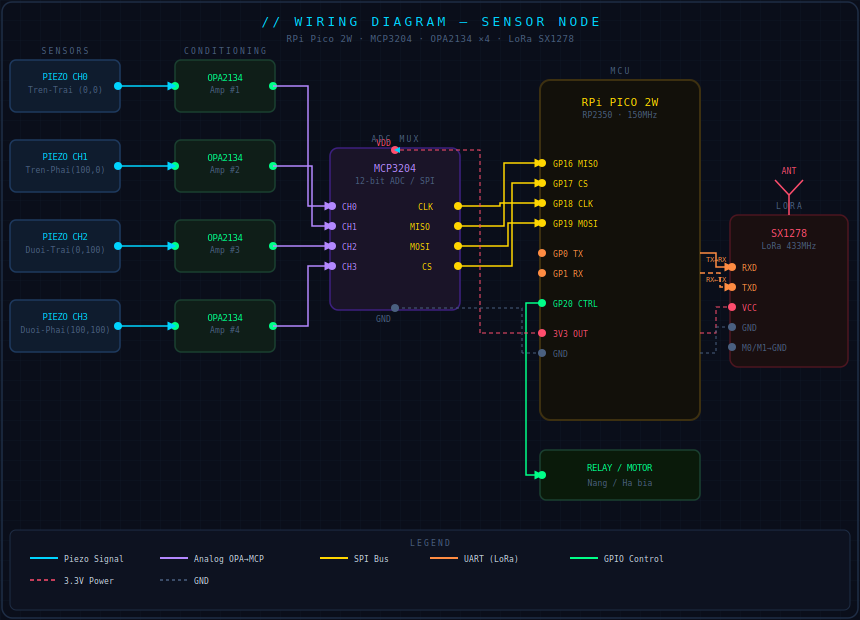
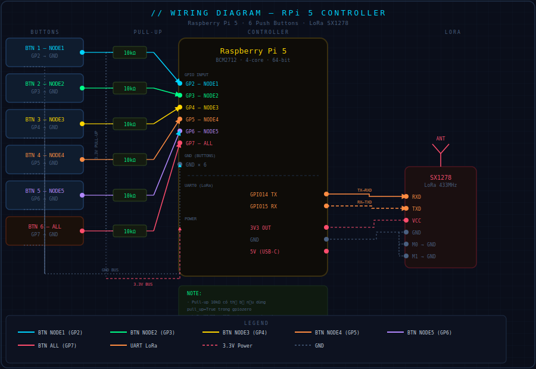

```markdown
# HTTDTD - Hệ Thống Tính Điểm Tự Động Dùng Cho Bắn Súng.

## DỰ ÁN ĐƯỢC TẠO BỞI Dunghero1412
## Người tạo dự án : Chiêm Dũng.
## Người bảo trì dự án : Chiêm Dũng.

**dự án đã được đăng ký giấy phép MIT license - bất kỳ cá nhân , tổ chức hoặc đơn vị nào cũng đều được phép clone , chỉnh sửa và sử dụng mã nguồn**

## 📋 Giới Thiệu Dự Án

**HTTDTD** là một hệ thống tính điểm tự động được thiết kế dành cho các trường bắn, sân tập bắn súng thật. Hệ thống sử dụng công nghệ **LoRa** (Long Range) để giao tiếp không dây giữa một bộ điều khiển trung tâm (RPi 5) và 5 bộ máy trạm (RPi Nano 2W), mỗi bộ được lắp đặt ở một bục bắn.

### 🎯 Tính Năng Chính

- **Tính điểm tự động**: Phát hiện viên đạn và tính toán tọa độ hit trên bia tự động
- **Giao tiếp LoRa**: Khoảng cách truyền lên tới vài km, không cần dây kết nối
- **Bảng điểm realtime**: Hiển thị tọa độ từ 5 Node trên màn hình controller theo thời gian thực
- **Lưu log tự động**: Tất cả dữ liệu điểm được lưu vào file `score.txt`
- **Giao diện đơn giản**: Chỉ cần bấm nút để điều khiển, không cần bàn phím chuột

```

---

## 🔧 Cách Hoạt Động Chung

### Sơ Đồ Hệ Thống
## 📊 Sơ Đồ Mạch
```
```
[Xem sơ đồ mạch chi tiết](docs/wiring_diagram.html)
## Sơ đồ mạch dành cho NODE:

## Sơ đồ mạch dùng cho CONTROLLER:

```
```
### Quy Trình Hoạt Động

#### **1. Giai Đoạn Khởi Động**
```
Controller (RPi 5) khởi động
    ↓
Khởi tạo GPIO cho 7 nút bấm
    ↓
Khởi tạo LoRa module
    ↓
Mở file log (score.txt)
    ↓
Chờ người dùng bấm nút
```

#### **2. Giai Đoạn Điều Khiển (Khi Bấm Nút)**
```
Người dùng bấm nút (VD: Nút NODE1)
    ↓
GPIO 2 phát hiện (từ HIGH → LOW)
    ↓
Callback function gửi lệnh "NODE1 UP" qua LoRa
    ↓
Node 1 nhận lệnh
    ↓
Node 1 đưa GPIO 20 lên HIGH (bật motor/actuator)
    ↓
Bắt đầu chờ viên đạn bay qua bia
```

#### **3. Giai Đoạn Phát Hiện Viên Đạn**
```
Viên đạn bay qua bia có 4 cảm biến Piezo ở 4 góc
    ↓
Cảm biến phát hiện tác động (giá trị ADC > ngưỡng)
    ↓
Ghi nhận thời gian phát hiện của mỗi cảm biến
    ↓
Sử dụng TDOA (Time Difference of Arrival) để tính tọa độ (x, y)
    ↓
Gửi tọa độ về Controller: "NODE1, x=-26, y=30"
```

#### **4. Giai Đoạn Hiển Thị & Lưu Log**
```
Controller nhận dữ liệu từ Node
    ↓
Phân tích dữ liệu (tách node_name, x, y)
    ↓
Cập nhật bảng điểm hiển thị
    ↓
Ghi vào file log (score.txt)
    ↓
Hiển thị bảng điểm mới nhất trên console
```

#### **5. Giai Đoạn Dừng**
```
Người dùng bấm nút lần thứ 2 (hoặc hết 60s)
    ↓
Callback function gửi lệnh "NODE1 DOWN"
    ↓
Node 1 nhận lệnh
    ↓
Node 1 đưa GPIO 20 về LOW (tắt motor/actuator)
    ↓
Dừng phát hiện viên đạn
```

### Chi Tiết Kỹ Thuật

#### **Giao Thức LoRa**
- **Tần số**: 915 MHz (ISM band - công nghiệp, khoa học, y tế)
- **Tốc độ baud**: 60000 bps
- **Khoảng cách**: Tối đa vài km (tùy môi trường)
- **Định dạng lệnh**: `NODE1 UP` hoặc `NODE1 DOWN`
- **Định dạng dữ liệu**: `NODE 1, -26, 30`

#### **Phương Pháp Tính Tọa Độ (TDOA - Time Difference of Arrival)**

Viên đạn chuyển động với vận tốc âm thanh (~340 m/s). Dựa trên thời gian phát hiện khác nhau ở 4 cảm biến, chúng ta có thể tính được vị trí chính xác:

```
Khoảng cách từ cảm biến = Vận tốc âm thanh × Thời gian phát hiện

VD: Nếu cảm biến A phát hiện tại t=0.001s
    d_A = 340 m/s × 0.001s = 0.34m = 34cm

Tọa độ được tính bằng phương pháp triangulation (tam giác)
dựa trên khoảng cách từ 4 cảm biến
```

#### **Cấu Hình MCP3204 ADC**
- **Kênh 0 (CH0)**: Sensor A (Góc trái dưới: -50, -50)
- **Kênh 1 (CH1)**: Sensor B (Góc trái trên: -50, 50)
- **Kênh 2 (CH2)**: Sensor C (Góc phải trên: 50, 50)
- **Kênh 3 (CH3)**: Sensor D (Góc phải dưới: 50, -50)
- **Độ phân giải**: 12-bit (0-4095)
- **Tốc độ SPI**: 1 MHz

---

## 🛠️ Yêu Cầu Phần Cứng & Phần Mềm

### Phần Cứng

#### **Controller (RPi 5)**
| Thành phần | Thông số | Ghi chú |
|-----------|---------|--------|
| Raspberry Pi 5 | 8GB RAM | Bộ điều khiển trung tâm |
| LoRa Module SX1278 | 915 MHz | Giao tiếp không dây |
| 7 Nút bấm NO | 5V logic | GPIO 2, 3, 4, 5, 6, 7, 8 |
| Nguồn điện | 5V 3A | Cấp điện cho RPi 5 |
| Dây USB-UART | CH340 hoặc PL2303 | Kết nối LoRa qua UART 1 |

#### **Node (RPi Nano 2W) - x5 bộ**
| Thành phần | Thông số | Ghi chú |
|-----------|---------|--------|
| Raspberry Pi Nano 2W | 512MB RAM | Bộ máy trạm |
| LoRa Module SX1278 | 915 MHz | Nhận lệnh từ Controller |
| MCP3204 ADC | 12-bit, 4 kênh | Đọc cảm biến Piezo |
| Cảm biến Piezoelectric | 4 cảm biến | Phát hiện viên đạn |
| Op-Amp | TL072 hoặc LM358 | Khuếch đại tín hiệu từ Piezo |
| Transistor/Relay | 5V | Điều khiển motor/actuator |
| Motor/Actuator | 5V-12V | Nâng/hạ bia |
| Nguồn điện | 5V 2A | Cấp điện cho Nano 2W |

### Phần Mềm

#### **Controller (RPi 5)**
```bash
# OS
- Raspberry Pi OS Bookworm (64-bit)

# Python Version
- Python 3.10 trở lên

# Thư viện Python
- RPi.GPIO (điều khiển GPIO)
- rpi-lora (giao tiếp LoRa)
```

#### **Node (RPi Nano 2W)**
```bash
# OS
- Raspberry Pi OS Lite Bookworm (32-bit)

# Python Version
- Python 3.10 trở lên

# Thư viện Python
- RPi.GPIO (điều khiển GPIO)
- rpi-lora (giao tiếp LoRa)
- spidev (giao tiếp SPI với MCP3204)
```

---

## 📦 Hướng Dẫn Cài Đặt Tự động

### 1. Clone Repository

```bash
# Clone từ GitHub
git clone https://github.com/Dunghero1412/HTTDTD.git
cd HTTDTD
# Clone trên mỗi board kể cả Controller và tất cả các node.
```

## 2. Cài đặt Controller (RPi 5)

#### 1.cài đặt file cơ bản.
```bash
sudo apt update
sudo apt upgrade
cd HTTDTD
chmod 755 /opt
python3 setup.py install controller
```
#### 2. cấu hình uart
```bash
# Mở raspi-config
sudo raspi-config

# Chọn: Interfacing Options → Serial Port
# Enable Serial: Yes
# Login shell: No
# Hardware serial: Yes

# Khởi động lại
sudo reboot
```
#### **Bước 3: Cài đặt Python packages**
```bash
# Cài pip (nếu chưa có)
sudo apt install python3-pip -y

# Cài các thư viện cần thiết
pip3 install RPi.GPIO rpi-lora
```


## 3. Cài đặt Node ( RPi Nano 2w)

#### 1. cài đặt file cơ bản.
```bash
sudo apt update
sudo apt upgrade 
cd HTTDTD
chmod 755
python3 setup.py install node<mã của node . ví dụ : 2>
```

#### Bước 2: Bật SPI
```bash
# Mở raspi-config
sudo raspi-config

# Chọn: Interfacing Options → SPI
# Enable SPI: Yes

# Khởi động lại
sudo reboot
```

#### Bước 3: Cài đặt Python packages
```bash
# Cài pip (nếu chưa có)
sudo apt install python3-pip -y

# Cài các thư viện cần thiết
pip3 install RPi.GPIO rpi-lora spidev adafruit-circuitpython-mcp3x0x
```


## 📦 Hướng Dẫn Cài Đặt Thủ Công

### 1. Clone Repository

```bash
# Clone từ GitHub
git clone https://github.com/Dunghero1412/HTTDTD.git
cd HTTDTD
```

### 2. Cài Đặt Controller (RPi 5)

#### **Bước 1: Cập nhật hệ thống**
```bash
sudo apt update
sudo apt upgrade -y
```

#### **Bước 2: Bật UART 1**
```bash
# Mở raspi-config
sudo raspi-config

# Chọn: Interfacing Options → Serial Port
# Enable Serial: Yes
# Login shell: No
# Hardware serial: Yes

# Khởi động lại
sudo reboot
```

#### **Bước 3: Cài đặt Python packages**
```bash
# Cài pip (nếu chưa có)
sudo apt install python3-pip -y

# Cài các thư viện cần thiết
pip3 install RPi.GPIO rpi-lora
```

#### **Bước 4: Copy file Controller**
```bash
# Copy file controller.py vào thư mục
cp controller.py ~/HTTDTD/
chmod +x ~/HTTDTD/controller.py
```

### 3. Cài Đặt Node (RPi Nano 2W)

#### **Bước 1: Cập nhật hệ thống**
```bash
sudo apt update
sudo apt upgrade -y
```

#### **Bước 2: Bật SPI**
```bash
# Mở raspi-config
sudo raspi-config

# Chọn: Interfacing Options → SPI
# Enable SPI: Yes

# Khởi động lại
sudo reboot
```

#### **Bước 3: Cài đặt Python packages**
```bash
# Cài pip (nếu chưa có)
sudo apt install python3-pip -y

# Cài các thư viện cần thiết
pip3 install RPi.GPIO rpi-lora spidev adafruit-circuitpython-mcp3x0x
```

#### **Bước 4: Copy file Node**
```bash
# Copy file node.py vào thư mục
cp node.py ~/HTTDTD/
chmod +x ~/HTTDTD/node.py
```

#### **Bước 5: Tùy chỉnh tên Node**
```bash
# Mở file node.py trên Node 1
nano ~/HTTDTD/node.py

# Tìm dòng: NODE_NAME = "NODE1"
# Thay đổi thành NODE2, NODE3, ... cho các Node khác
# Lưu file (Ctrl+X, Y, Enter)
```

---

## 🚀 Cách Sử Dụng

### 1. Khởi Động Controller

```bash
# Trên RPi 5
cd ~/HTTDTD
python3 controller.py
```

**Output kỳ vọng:**
```
[INIT] LoRa initialized at 915MHz
============================================================
[2024-04-17 10:25:30] CONTROLLER STARTED - RPi 5
============================================================
```

### 2. Khởi Động Các Node

```bash
# Trên mỗi RPi Nano 2W
cd ~/HTTDTD
python3 node.py
```

**Output kỳ vọng:**
```
============================================================
NODE STARTED - NODE1
============================================================
[SENSOR] Waiting for impact...
```

### 3. Thực Hiện Bắn Súng

#### **Quy Trình**
1. **Bấm nút điều khiển** (ví dụ: NODE1) trên Controller
   - Motor/actuator sẽ nâng bia lên
   - Console hiển thị: `[TX] Sent: NODE1 UP`

2. **Bắn viên đạn** vào bia tương ứng
   - Viên đạn sẽ bay qua bia, tác động vào 4 cảm biến
   - Node sẽ phát hiện và tính tọa độ

3. **Node gửi dữ liệu** về Controller
   - Console hiển thị: `[RX] Received: NODE 1, -26, 30`
   - Bảng điểm được cập nhật

4. **Bấm nút lần thứ 2** để dừng
   - Motor/actuator sẽ hạ bia xuống
   - Console hiển thị: `[TX] Sent: NODE1 DOWN`

### 4. Xem Kết Quả

#### **Trên Console (Bảng Điểm Realtime)**
```
============================================================
SHOOTING RANGE SCORING SYSTEM
============================================================
|     NODE1      |     NODE2      |     NODE3      |     NODE4      |     NODE5      |
X:  |     -26     |       15       |       45       |      None      |      None      |
Y:  |      30     |      -20       |       50       |      None      |      None      |
============================================================
```

#### **File Log (score.txt)**
```
[2024-04-17 10:25:30] CONTROLLER STARTED - RPi 5
[2024-04-17 10:25:35] [TX] Sent: NODE1 UP
[2024-04-17 10:25:40] [RX] Received: NODE 1, -26 , 30
[2024-04-17 10:25:41] [RX] Received: NODE 1, -15 , 20
[2024-04-17 10:25:42] [RX] Received: NODE 1, 5 , -10
[2024-04-17 10:25:45] [TX] Sent: NODE1 DOWN
```

---

## 📁 Cấu Trúc Thư Mục

```
HTTDTD/
│
├── README.md                 # Tài liệu này
├── controller.py             # Code cho RPi 5 (Controller)
├── node.py                   # Code cho RPi Nano 2W (Node)
├── score.txt                 # File log kết quả (tự động tạo)
│
├── docs/                     # Tài liệu chi tiết
│   ├── hardware-setup.md     # Hướng dẫn lắp ráp phần cứng
│   ├── wiring-diagram.md     # Sơ đồ đấu nối
│   └── calibration.md        # Hướng dẫn calibrate
│
└── examples/                 # Ví dụ sử dụng
    └── sample-log.txt        # Ví dụ file log
```

---

## 🔧 Hướng Dẫn Calibrate & Troubleshoot

### 1. Calibrate Ngưỡng Phát Hiện (Threshold)

**Vấn đề**: Hệ thống không phát hiện viên đạn hoặc phát hiện sai

**Cách giải quyết**:

#### **Bước 1: Tìm giá trị ADC thực tế**

Sửa file `node.py` để in giá trị ADC:

```python
# Tìm hàm read_all_sensors() và thêm dòng này:
print(f"  Sensor {sensor_name} (CH{channel}): {value}")
```

#### **Bước 2: Bắn thử**

```bash
# Chạy Node
python3 node.py

# Bắn vài viên vào bia
# Xem console in ra giá trị ADC của các sensor
```

**Output ví dụ**:
```
Sensor A (CH0): 1500
Sensor B (CH1): 3200
Sensor C (CH2): 2800
Sensor D (CH3): 1700
```

#### **Bước 3: Điều chỉnh Threshold**

Nếu thấy các sensor phát hiện được giá trị 2000-3500, điều chỉnh:

```python
# Trong node.py, tìm dòng:
IMPACT_THRESHOLD = 2000

# Thay đổi thành giá trị phù hợp (thường 1800-2200)
IMPACT_THRESHOLD = 2000
```

### 2. Kiểm Tra Kết Nối LoRa

#### **Vấn đề**: Controller không thể nhận/gửi dữ liệu

**Kiểm tra**:

```bash
# 1. Kiểm tra port UART
ls -la /dev/ttyAMA*

# Kết quả kỳ vọng: /dev/ttyAMA1 (hoặc /dev/ttyAMA0)

# 2. Kiểm tra baud rate
dmesg | grep ttyAMA

# 3. Kiểm tra quyền truy cập
sudo usermod -a -G dialout $USER
```

### 3. Kiểm Tra Kết Nối SPI (Node)

#### **Vấn đề**: Node không thể đọc MCP3204

**Kiểm tra**:

```bash
# 1. Bật SPI
sudo raspi-config

# 2. Kiểm tra SPI device
ls -la /dev/spidev*

# Kết quả kỳ vọng: /dev/spidev0.0

# 3. Kiểm tra I2C (nếu dùng I2C)
i2cdetect -y 1

# Kỳ vọng: Thấy MCP3204 ở địa chỉ 0x68 hoặc địa chỉ tương tự
```

### 4. Kiểm Tra GPIO

#### **Vấn đề**: Nút bấm không hoạt động

**Kiểm tra**:

```bash
# 1. Xem trạng thái GPIO
gpioinfo

# 2. Test GPIO bằng tay
python3 << 'EOF'
import RPi.GPIO as GPIO
import time

GPIO.setmode(GPIO.BCM)
GPIO.setup(2, GPIO.IN, pull_up_down=GPIO.PUD_UP)

while True:
    state = GPIO.input(2)
    print(f"GPIO 2: {state}")
    time.sleep(0.5)
EOF

# Bấm nút, xem trạng thái thay đổi từ 1 -> 0
```

### 5. Kiểm Tra Ghi File Log

#### **Vấn đề**: File score.txt không được tạo

**Kiểm tra**:

```bash
# 1. Xem quyền thư mục
ls -la ~/HTTDTD/

# Thêm quyền nếu cần
chmod 777 ~/HTTDTD/

# 2. Tạo file log thủ công
touch ~/HTTDTD/score.txt
chmod 666 ~/HTTDTD/score.txt

# 3. Chạy Controller lại
python3 controller.py
```

### 6. Debug Dữ Liệu

#### **Xem dữ liệu realtime**

```bash
# Terminal 1: Chạy Controller
python3 controller.py

# Terminal 2: Giám sát file log
tail -f score.txt

# Bấm nút và xem dữ liệu được ghi vào log
```

---

## 📊 Ví Dụ Sử Dụng Thực Tế

### Kịch Bản: Thi Bắn Súng 5 Vận Động Viên

```
VĐV 1 (Node1)    VĐV 2 (Node2)    VĐV 3 (Node3)    VĐV 4 (Node4)    VĐV 5 (Node5)
    ↓                ↓                ↓                ↓                ↓
  Bia 1            Bia 2            Bia 3            Bia 4            Bia 5
(4 Piezo)        (4 Piezo)        (4 Piezo)        (4 Piezo)        (4 Piezo)

          Controller (RPi 5)
         (Điều khiển + Hiển thị)
```

**Quy Trình**:
1. VĐV 1 sẵn sàng → Bấm nút Node1 → Bia nâng lên
2. VĐV 1 bắn 3 viên → Node1 gửi 3 tọa độ về Controller
3. VĐV 1 xong → Bấm nút Node1 → Bia hạ xuống
4. Lặp lại cho VĐV 2, 3, 4, 5
5. Tất cả kết quả được hiển thị trên màn hình + lưu trong score.txt

**Bảng kết quả cuối cùng**:
```
============================================================
SHOOTING RANGE SCORING SYSTEM
============================================================
|     NODE1      |     NODE2      |     NODE3      |     NODE4      |     NODE5      |
X:  |     -15     |       10       |      -30       |       25       |      -25       |
Y:  |      25     |      -15       |       30       |      -10       |       20       |
X:  |      -5     |       20       |      -20       |       35       |      -15       |
Y:  |      30     |       -5       |       25       |       -5       |       25       |
X:  |       5     |       15       |      -10       |       30       |      -20       |
Y:  |      20     |      -10       |       20       |       -15      |       15       |
============================================================
```

---

## 🐛 Các Lỗi Thường Gặp & Giải Pháp

| Lỗi | Nguyên Nhân | Giải Pháp |
|-----|-----------|---------|
| `ModuleNotFoundError: No module named 'rpi_lora'` | Chưa cài đặt thư viện | `pip3 install rpi-lora` |
| `PermissionError: /dev/ttyAMA1` | Không có quyền truy cập UART | `sudo usermod -a -G dialout $USER` |
| `No module named 'spidev'` (Node) | Chưa cài spidev | `pip3 install spidev` |
| Nút bấm không phản ứng | GPIO chưa được khởi tạo đúng | Kiểm tra chân GPIO có đúng không |
| Không nhận dữ liệu từ Node | LoRa không giao tiếp được | Kiểm tra UART, tần số LoRa |
| `FileNotFoundError: score.txt` | File log không tồn tại | Tạo file: `touch score.txt` |
| Tọa độ X, Y = None | Không phát hiện đủ 2 cảm biến | Calibrate lại threshold |

---

## 📞 Hỗ Trợ & Liên Hệ

Nếu gặp vấn đề hoặc có câu hỏi, vui lòng:

- Tạo **Issue** trên GitHub
- Kiểm tra phần **Troubleshoot** ở trên
- Xem **File Log** (score.txt) để tìm lỗi
- Hoặc liên hệ qua email: **dhr151103@gmail.com**


---

## 📝 License

Dự án này được cấp phép dưới **MIT License**. Bạn được tự do sử dụng, sửa đổi và phân phối.

---

## 👨‍💻 Tác Giả

Dự án HTTDTD được phát triển bởi **Dunghero1412**

---

## 🙏 Lời Cảm Ơn

Cảm ơn đã sử dụng hệ thống HTTDTD!

**Chúc bạn thành công với dự án!** 🎯🚀

